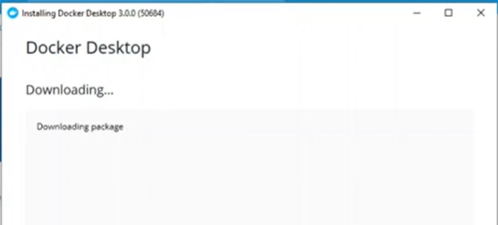
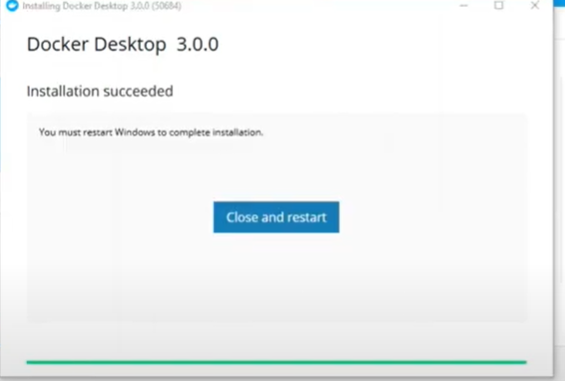
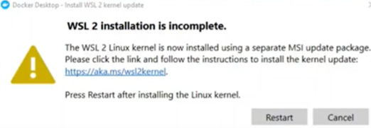
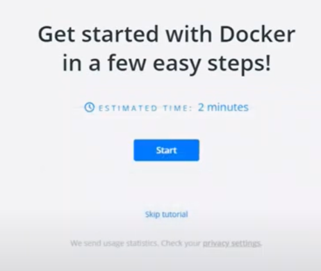
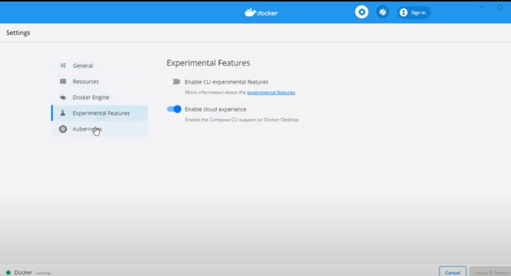

# Docker

# 1.Entramos en la pagina oficial de docker y le damos a docker para windows y le damos a instalar.

# 2.Cuando instalemos el .exe nos abrira esta ventana para empezar tendremos que esperar a que se desempaquete.

# 3.Cuando haya acabado el proceso de desenpaquetado le damos a cerrar y reiniciar.

# 4.Cuanda hemos reiniciado no va aparecer que la instalacion esta incompleta y le damos a continuar cuando acabemos tenemos la posibilidad de empezar un tutorial.

# 5.Cuando hayamos acabado ya podemos entrar a la aplicacion sin problema

